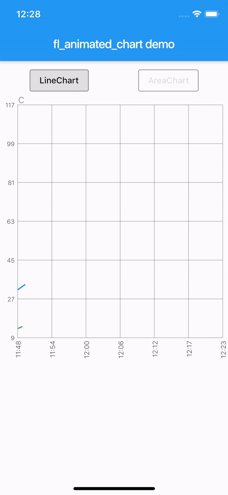
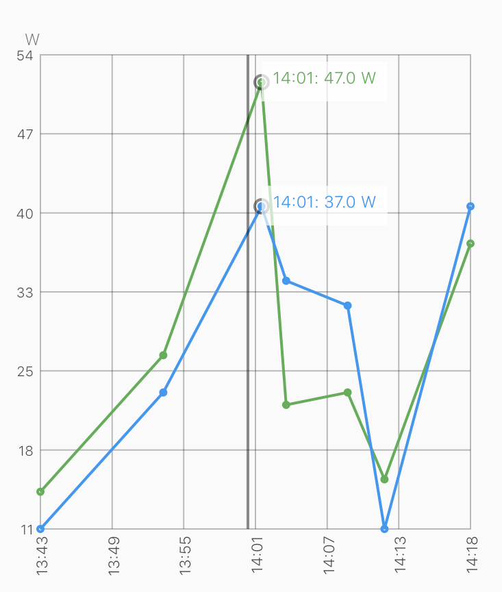
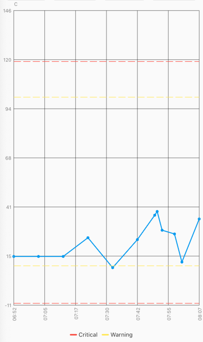
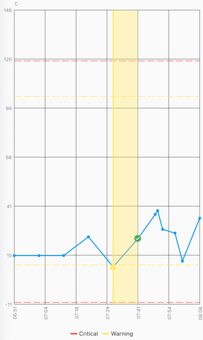
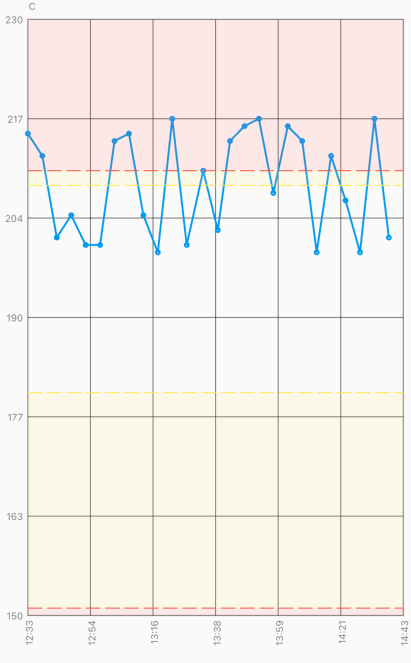
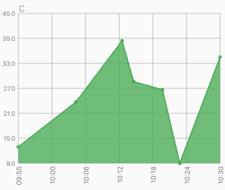
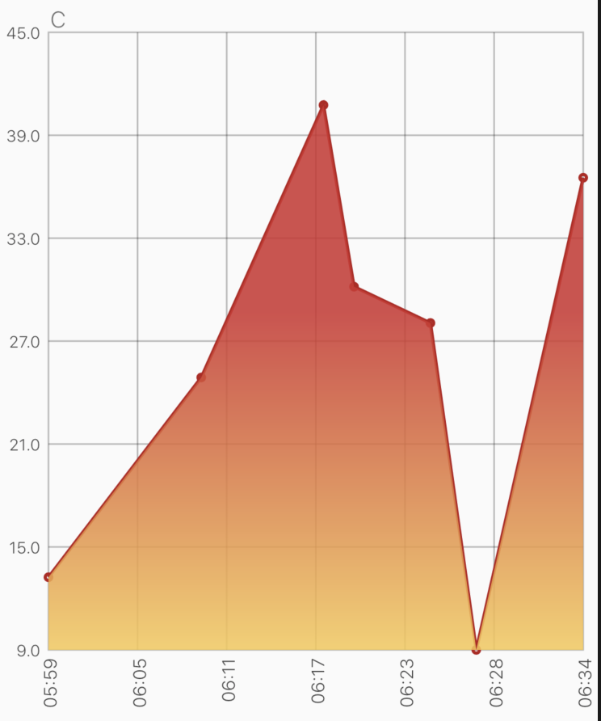
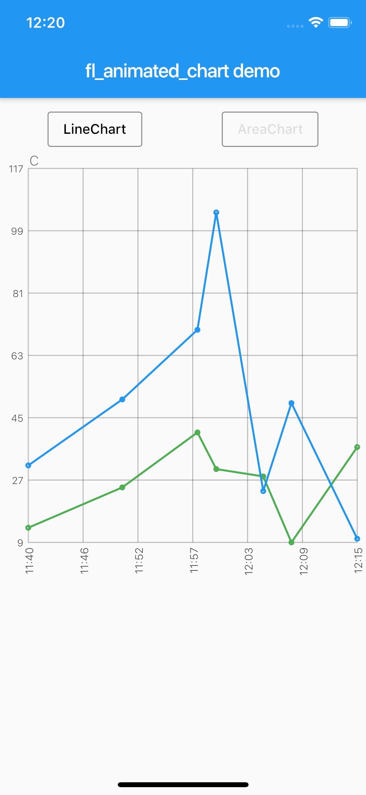

# fl_animated_linechart

[](https://codemagic.io/apps/5d5e513ff8278e001ca52adf/5d5e513ff8278e001ca52ade/latest_build)



An animated chart library for flutter.
 - Support for datetime axis
 - Multiple y axis, supporting different units
 - Highlight selection
 - Animation of the chart
 - Possibility of adding legends
 - Support for both horizontal and vertical markerlines 
 - Tested with more than 3000 points and still performing

There are currently two different charts:
 - line chart
 - area chart

## Getting Started

Try the sample project or include in your project.

Highlight for the line chart:





Area chart:



Example code:
```dart
    LineChart lineChart = LineChart.fromDateTimeMaps([line1, line2], [Colors.green, Colors.blue]);

    return Scaffold(
      appBar: AppBar(
        title: Text(widget.title),
      ),
      body: Container(
        child: Column(
            mainAxisSize: MainAxisSize.max,
            mainAxisAlignment: MainAxisAlignment.spaceBetween,
            crossAxisAlignment: CrossAxisAlignment.stretch,
            children: [
              Expanded(child: AnimatedLineChart(lineChart)),
            ]
        ),
      ),
    );
```
<br/>
Example code with horizontal markerlines and legends:

    LineChart lineChart = LineChart.fromDateTimeMaps([
        line1,
        line2,
        line3,
        line4,
        line5
      ], [
        Colors.blue,
        Colors.red,
        Colors.yellow,
        Colors.yellow,
        Colors.red
      ], [
        'C',
        'C',
        'C',
        'C',
        'C',
      ], tapTextFontWeight: FontWeight.w400);

  To define a line as a horizontal dashed markerline, first define the line as any other regular line, then set isMarkerLine to true:<br/>

    lineChart.lines[1].isMarkerLine = true;
    lineChart.lines[2].isMarkerLine = true;
    lineChart.lines[3].isMarkerLine = true;
    lineChart.lines[4].isMarkerLine = true;
      
  Or: <br/>
  ```dart
    lineChart.lines.skip(1).forEach((line) {
        line.isMarkerLine = true;
      });
  ```
  Legends: <br/>
  A Legend has the following constructor: <br/>
  ```dart
      const Legend({this.title, this.color, this.icon, this.style, this.showLeadingLine = false,});
  ```
    
  You can choose to either have a short line or an Icon as the first part of the legend before the title. It is possible set showLeadingLine to true, then a short line will be shown in the color you have defined. <br/>
  You can change the Color of the line and Icon, and the TextStyle of the String title. <br/>
  The length of the Legends list must to equal to the length of chartlines which have isMakerLine = true. <br/>
  
  When orientation of the screen is in landscape mode, it is possible to have the legends drawn on the right hand side instead of below the graph. 
  Simply set ``` legendsRightLandscapeMode: true ``` <br/>

```dart 
      return Scaffold(
      appBar: AppBar(
        title: Text(widget.title),
      ),
      body: Container(
        child: Column(
          mainAxisSize: MainAxisSize.max,
          mainAxisAlignment: MainAxisAlignment.spaceBetween,
          crossAxisAlignment: CrossAxisAlignment.stretch,
          children: [
            Expanded(
              child: AnimatedLineChart(
                lineChart,
                toolTipColor: Colors.white,
                gridColor: Colors.black54,
                textStyle: TextStyle(fontSize: 10, color: Colors.black54),
                showMarkerLines:
                    true, // If this value is not set to true, all defines lines will be filled lines and not dashed
                legends: [
                  Legend(title: 'Critical', color: Colors.red, showLeadingLine: true),
                  Legend(title: 'Warning', color: Colors.yellow, Icon(Icons.report_problem_rounded, size: 17, color: Colors.yellow)),
                ],
                legendsRightLandscapeMode: true,
              ),
            ),
          ],
        ),
      ),
    ); 
```
<br/>
Example code with horizontal and vertical markerlines along with icons on the chart and legends:

  It is possible to define a maximum of two vertical markerlines. <br/>
  The verticalMarker variable is a ``` List<DateTime> ``` and the length can be >= 2. <br/>
  If two vertical markerlines are defined, the area between the two lines will be filled with a color that can be defined with verticalMarkerColor.<br/>

  It is possible to add an Icon on the point where the vertical markerline crosses the y-axis value by defining the verticalMarkerIcon. <br/>
  The verticalMarkerIcon variable takes a ``` List<Icon> ``` and the lenght must be equal to the length of the verticalMarker variable. <br/>
  The possibility of adding a colored background to the icons have been added and can be defined with iconBackgroundColor which takes a Color. <br/>

```dart 
      return Scaffold(
      appBar: AppBar(
        title: Text(widget.title),
      ),
      body: Container(
        child: Column(
          mainAxisSize: MainAxisSize.max,
          mainAxisAlignment: MainAxisAlignment.spaceBetween,
          crossAxisAlignment: CrossAxisAlignment.stretch,
          children: [
            Expanded(
              child: AnimatedLineChart(
                lineChart,
                toolTipColor: Colors.white,
                gridColor: Colors.black54,
                textStyle: TextStyle(fontSize: 10, color: Colors.black54),
                showMarkerLines:
                    true, // If this value is not set to true, all defines lines will be filled lines and not dashed
                legends: [
                  Legend(title: 'Critical', color: Colors.red),
                  Legend(title: 'Warning', color: Colors.yellow),
                ],
                verticalMarker:[
                    DateTime.parse('2012-02-27 12:54:00'),
                    DateTime.parse('2012-02-27 13:16:00')
                        ],
                  verticalMarkerColor: Colors.yellow,
                  verticalMarkerIcon: [
                    Icon(
                      Icons.report_problem_rounded,
                      color: Colors.yellow,
                    ),
                    Icon(
                      Icons.check_circle_rounded,
                      color: Colors.green,
                    ),
                  ],
                  iconBackgroundColor: Colors.white,
              ),
            ),
          ],
        ),
      ),
    );
```

Example code with shaded area between markerlines:
It is possible to have shaded areas between the defined markerlines. <br/>
The shaded area will be in the same color as the markerline. <br/>
It is important that the order of enums in the ``` List<MaxMin> ``` filledMarkerLinesValues matches the order of defined markerlines to be shown in the graph. <br/>
Enums with the value MaxMin.MAX will draw to the top if there is only one markerline defined as MAX, otherwise it will draw from i - 1 where enum values are MAX. <br/>
If enum value is MaxMin.MIN the shaded area will draw downwards to i + 1, unless the index is the last in the list, then the shaded area will draw all the way to the bottom of the graph. <br/>
```dart 
      return Scaffold(
      appBar: AppBar(
        title: Text(widget.title),
      ),
      body: Container(
        child: Column(
          mainAxisSize: MainAxisSize.max,
          mainAxisAlignment: MainAxisAlignment.spaceBetween,
          crossAxisAlignment: CrossAxisAlignment.stretch,
          children: [
            Expanded(
              child: AnimatedLineChart(
                  chart,
                  key: UniqueKey(),
                  gridColor: Colors.black54,
                  textStyle: TextStyle(fontSize: 10, color: Colors.black54),
                  toolTipColor: Colors.white,
                  showMarkerLines: true,
                  fillMarkerLines: true,
                  filledMarkerLinesValues:[
                          MaxMin.MAX,
                          MaxMin.MAX,
                          MaxMin.MIN,
                          MaxMin.MIN,
                        ],
              ),
            ),
          ],
        ),
      ),
    );

```

The example app, can toggle between line chart and area chart.

